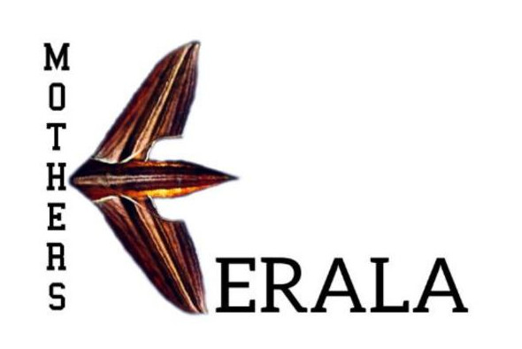

# A dataset for Moths of Kerala State, Southern India

This Dataset Curated by Volunteers of Moth-ers of Kerala and maintained by Kerala Biodiversity Monitoring Network.
This Version contain scientific binomen of Moths (Order: Lepidoptera) found in Kerala. Data procceded from iNaturalist.org,a crowdsourced citizen science platform project (https://www.inaturalist.org/projects/kerala-biodiversity-monitoring-network) date 27 July 2021. This contains 680 sp list from 4500+ research grade observations in Moths of Kerala Project(https://www.inaturalist.org/projects/moths-of-kerala). Preparing version1  of this dataset, Thanking https://fossunited.org/ for the Fellowship to Manoj Karingamadathil. We Thanking all contributors & Identifiers in iNaturalist Kerala.

This is a preliminary verstion of moths of kerala data and we are trying to add more attributes. Issues/Updates with the dataset can be reported at https://github.com/kerala-biodiversity/kerala-moths-data
<!---
## Introduction

## Taxonomy 

## Data Structure 

## Workflow

## License 

## Contributors 

## Community
-->
